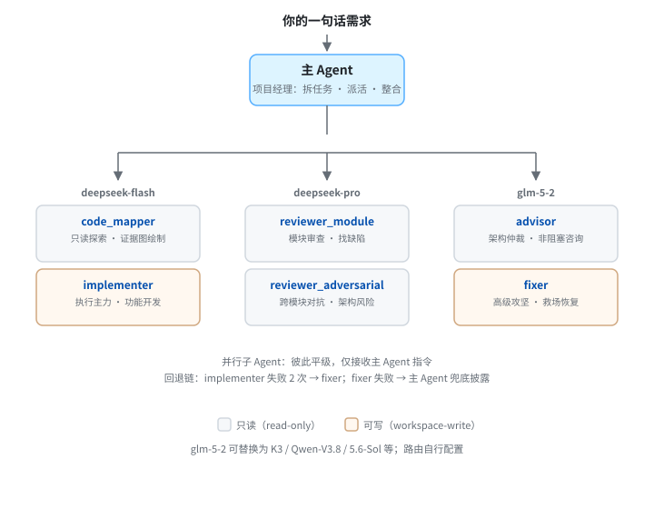

# Bitto-Codex-MultiAgentPrompt

> 多 Agent 协作规范（prompt v1），让主 Agent 自动拆分复杂任务、并行派发给子 Agent、独立审查、整合交付。适用于 GLM-5-2、Bitto 网关及各类 Agent 框架。

---

## 设计出发点

前沿大模型什么都能干，但让最贵的模型从规划写到测试再自查一遍，**成本高且效率低**。昂贵的模型应当专注于决策与把关，代码实现、文件扫描、机械检查等工作应由更经济的模型并行完成。

本仓库提供的是一份**协作规则书**（`AGENTS.md`），它定义了主 Agent 如何：

- 判定何时必须**拆解任务，并行派发给多个子 Agent**，而非独立包揽；
- 为每个子 Agent 划分**明确的专长与边界**；
- 通过**结构化工单与回执机制**实现可审计的团队协作；
- 在异常情况下**按预设路径回退、换人、上报**。

你无需通读规范的全部细节——只需将 `AGENTS.md` 置入项目根目录，主 Agent 会自动依规工作。

---

## 文件清单

| 文件 | 用途 | 使用方式 |
|---|---|---|
| `AGENTS.md` | 多 Agent 协作规范（完整版，约 44K）——包含任务派发、并行执行、独立审查、信箱协议、心跳与回退机制 | 放至项目根目录（多数 Agent 框架会自动加载）；如需纯文本粘贴，直接复制此文件内容即可 |

仓库只保留一个规范文件，没有多余版本。

---

## 配套工具：多模型路由

本规范默认使用三个模型（deepseek-flash、deepseek-pro、GLM-5-2）。**GLM-5-2 可按需替换为 K3、Qwen-V3.8、5.6-Sol 等其他模型**——只需确保 Agent 框架中对应的模型名称映射一致即可。多模型路由（将不同模型统一接入同一入口，按 `model` 字段分发请求）属于运行环境配置，可自行搭建或选用现有工具。

以 Codex 场景为例，可使用 [CCSwitchMulti](https://github.com/BigStrongSun/ccswitchmulti) 在 Codex 后方部署本地代理，将 OpenAI 订阅、DeepSeek、GLM、本地模型等统一接入，实现主 Agent 用官方模型决策与把关、执行与审查任务路由至更经济模型的效果。详细配置参见其 [Codex 多路由使用说明](https://github.com/BigStrongSun/ccswitchmulti/blob/main/docs/guides/codex-multirouter-guide-zh.md)。

> 本规范仅定义 Agent 间的协作逻辑，不绑定特定模型或路由方案。模型选型与路由策略由运行环境决定，是可配置的选项。

---

## 核心概念概览



- **主 Agent（primary）**：承担项目经理角色——拆解任务、派发工单、等待交付、逐项验收、整合为一份完整响应。**其自身不参与业务代码编写。**
- **三个子 Agent**（均为第一层，禁止再开子 Agent）：
  - **deepseek-flash**：执行主力。负责定义清晰的功能开发、跨模块对接、前端页面、测试用例、CI/文档与仓库组装。
  - **deepseek-pro**：只读审查员。负责架构风险评估、安全审计、失败路径验证、边界条件检查。**只挑错，不写实现。**
  - **GLM-5-2**：高级攻坚手。处理模糊需求、跨系统集成、高难度可视化、长上下文、高风险实施或需要"救场"的任务。
- **信箱通信（mailbox）**：主 Agent 与子 Agent 之间以存放在 Git 公共目录下的**结构化工单（envelope）**进行通信。每个工单包含唯一编号、版本号和内容指纹，确保消息不丢失、不重复、不混淆。
- **触发条件（M1–M7）**：规范定义了 7 类"必须启动正式拆解流程"的场景——包括项目级评估、跨模块变更、发布操作、非平凡前端任务等。命中任一条件，主 Agent 必须走完整派单流程。
- **回退机制（fallback）**：deepseek-flash 连续两次无法完成同一块任务时，主 Agent 将该范围移交至 GLM-5-2 处理；仅当此链路仍失败时，主 Agent 自行兜底并在响应中如实披露。

---

## 使用方式

### 推荐：置于项目根目录

主流 Agent 框架（Codex、Claude Code、Cursor、CodeBuddy 等）在启动时自动读取项目根目录下的 `AGENTS.md` 作为行为准则。

```bash
# 进入你的项目根目录执行
git clone https://github.com/zhushihao/Bitto-Codex-MultiAgentPrompt.git
# 或仅下载规范文件
curl -OL https://raw.githubusercontent.com/zhushihao/Bitto-Codex-MultiAgentPrompt/main/AGENTS.md
```

确认 Agent 框架中三个模型可用（deepseek-flash、deepseek-pro、glm-5-2，名称映射一致即可）。之后正常下达任务即可，主 Agent 会自动依规处理。

### 备选：作为 system prompt 粘贴

若所用框架不支持读取 `AGENTS.md`，可复制 `AGENTS.md` 的全部内容，粘贴至 Agent 的 system prompt 输入框中使用。

---

## 运行示例

**场景**：为一个前端项目新建带状态筛选的数据表格页面。

1. 项目根目录已放置 `AGENTS.md`。
2. 下达指令：*"在 src/pages 下新建一个 DataGrid 组件，支持按状态筛选，要求响应式布局，适配桌面与移动端。"*
3. 规范判定命中 **M7（非平凡前端——涉及响应式交互、多段布局与前端逻辑）**，主 Agent 执行派单：
   - `deepseek-flash`（reasoning_effort=max）——实现组件、样式与基本验证；
   - `deepseek-pro`（reasoning_effort=medium）——对成品进行正确性审查；
   - 若遇跨域数据源或复杂可视化难点，`GLM-5-2`（reasoning_effort=high）被调用攻坚。
4. 主 Agent 等待子 Agent 交付 → 进行集成验收（桌面/移动端渲染、交互功能、控制台无报错）→ 输出**一份整合后的结果**。

你只需下达上述一条指令。

---

## 模型路由参考（主 Agent 内置逻辑，使用者无需操作）

| 任务特征 | 下发模型与思考强度 |
|---|---|
| 功能实现、模块对接、测试编写、文档与仓库组装 | `deepseek-flash`（reasoning_effort=max） |
| Bug 定位、架构审计、安全评估、边界条件验证 | `deepseek-pro`（reasoning_effort=medium，只读） |
| 模糊需求、跨系统集成、高难度可视化、高风险或救场实施 | `GLM-5-2`（reasoning_effort=high） |
| 文件扫描、证据抽取、机械检查 | `deepseek-flash`（reasoning_effort=medium） |

> reasoning_effort 是模型思考强度设定（max / high / medium），主 Agent 在派单时自动配置。成本顺序：deepseek-flash < deepseek-pro < GLM-5-2。主 Agent 会优先选择成本较低的模型，仅在证据不足时升级。

---

## FAQ

**Q：完全不了解 prompt 工程，可以使用吗？**
可以。将 `AGENTS.md` 放至项目根目录即可。规范本身是写给 Agent 阅读的，你只需正常下达任务。

**Q：三个子 Agent 都需要单独申请和付费吗？**
是的，需要在你使用的 Agent 框架或网关中保证对应的模型可用。默认使用 deepseek-flash、deepseek-pro、GLM-5-2；**GLM-5-2 可按需替换为 K3、Qwen-V3.8、5.6-Sol 等其他模型**，只需名称映射一致即可。本规范仅定义协作逻辑，不绑定特定模型。

**Q：子 Agent 会互相串扰或无限嵌套吗？**
不会。规范强制所有子 Agent 处于第一层，禁止再派生子 Agent。只有主 Agent 有权派发任务和发起审查。

**Q：任务卡住或 Agent 失联怎么办？**
规范内置基于任务难度的 inactivity window（活动等待窗口）：主 Agent 为每个子 Agent 设定合理等待时间，超时且无任何活动迹象时进行探活而非立即中断。确认失联后按回退链换人处理，并在最终回复中披露过程。

**Q：规范是否会修改项目中的无关文件？**
不会。保留用户及其他来源的更改是被列为硬约束的规则（I7）。任何冲突均上报处理，不会未经确认即回退。

---

## 术语表

| 术语 | 说明 |
|---|---|
| primary（主 Agent） | 项目经理，负责任务分解、派发、验收与整合 |
| sub-agent（子 Agent） | 被派发的执行者，平级、仅接受 primary 指令 |
| envelope（工单） | primary 发送给子 Agent 的结构化任务描述文件，存放于 Git 公共目录 |
| mailbox（信箱） | 工单与回执的存储目录，Agent 间通过其通信 |
| M1–M7 | 7 类触发条件，满足任一即须启动正式拆单流程 |
| GATE_RECORD | 正式派单前须发布的分配记录 |
| fallback（回退） | Agent 无法完成任务时的换人与升级路径 |
| TAINTED | 被标记为不可信的内容，下游 Agent 不得直接引用 |
| reasoning_effort | 模型思考强度参数（medium / high / max），主 Agent 派活时设定 |

---

## 信箱协议（内部实现，不影响日常使用）

规范采用基于文件系统的信箱协议（第一版）作为 Agent 间通信机制：

- 工单存放路径基于 Git 公共目录（`GIT_COMMON_DIR`），不依赖工作区根目录，避免多工作树相互干扰。
- 每封工单包含约 27 个必填字段（任务 ID、版本号、内容哈希、目标 Agent、范围定义、排除项、验收标准等）。字段缺失时子 Agent 直接返回无效回执并退出，不会在未明确指令的情况下进行操作。
- 所有回执（确认、心跳、结果、无效报告）均携带任务 ID、版本号、内容哈希、关卡 ID 和范围版本，确保通信双方指向同一任务、同一版本。
- 主 Agent 采用"临时文件写入 + 持久化 + 原子替换 + 内容校验"方式发布工单，防止写入过程中被错误读取。

普通使用者无需深入理解这些细节——它们的设计目的是确保协作过程的**可审计性与可复现性**。

---

## 修订历史

- 2026-07-29：初始发布。多 Agent 协作规范（第一版），含信箱协议（基于 Git 公共目录）、任务工单、并行派发、独立审查与回退机制；适配模型 deepseek-flash / deepseek-pro / GLM-5-2。

---

## License

MIT License — 可自由使用、修改、分发。详见 [LICENSE](LICENSE) 文件。
